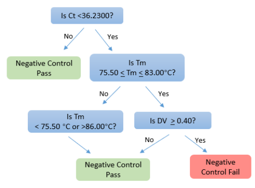
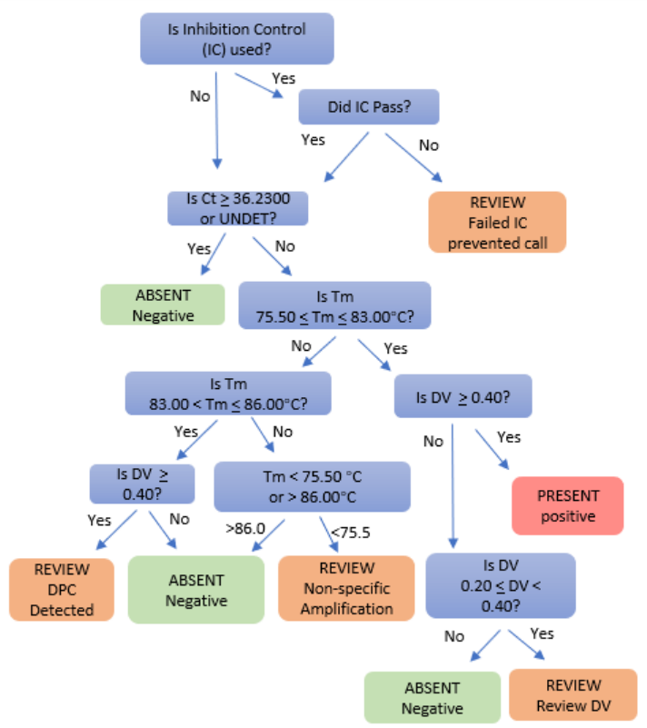

```{r setup, include=FALSE}
knitr::opts_chunk$set(
  echo = FALSE, 
  message = FALSE, 
  warning = FALSE)

# 1. Load excel into R
# 2. Extract the relevant data/information
# 3. Perform the QC checks
# 4. Create a report
# 5. Save/export the report

library(readxl)
library(tidyverse)
library(knitr)
library(kableExtra)
library(plotly)
library(formattable)
library(DT)
library(ggplot2)


source("R/functions.R")

message(rmarkdown::metadata$runtime)

set_Progress <- function (x) {
  if (params$rendered_by_shiny) {
    shiny::setProgress(x)  # set progress to x*100%
  }
}

colorize <- function(x, color) {
  if (knitr::is_latex_output()) {
    sprintf("\\textcolor{%s}{%s}", color, x)
  } else if (knitr::is_html_output()) {
    sprintf("<span style='color: %s;'>%s</span>", color,
      x)
  } else x
}

# source_file <- choose.files() #"datafiles/eg_1.xls"
extracted_df <- extract_df(params$source_file)

setup_after_id <- idenitfy_sample_type(extracted_df$raw_results)
```

```{r experiment-details}
set_Progress(0.1)
extracted_df$raw_sample_info %>% column_to_rownames(var = "Field") %>% formattable( col.names = "")

```

------------------------------------------------------------------------

```{r Perform-QC, include=FALSE}
set_Progress(0.2)
# ------- Perform the QC checks -----------------

## A. Positive controls

### 1. Filter for only type == POS
### 2. POS_01: Check for 23.5000 <= Ct <= 27.5000
### 3. POS_02: Check for 83.0 < Tm < 86.0
### 4. POS_03: Check for DV >= 30000
setup_for_POS <- POS_QC(setup_after_id)

# B. Check NTC conditions

### 1. Filter for only type == NTC
### 2. NTC_01: Is Ct < 36.2300?
### 3. NTC_02: Is 75.50 <= Tm <= 83.00?
### 4. NTC_03: Is Tm < 75.50 or Tm > 86.00?
### 5. NTC_04: Is DV > 30000?
setup_for_NEG <- NEG_QC(setup_after_id) 

# C. Check IHC conditions

### 1. Filter for only type == IHC
### 2. IHC_01: Does it passed POS Control?
### 3. IHC_02: Is Ct >= 36.2300?
### 4. IHC_03: Is 75.50 <= Tm <= 83.00?
### 5. IHC_04: Is 83.00 <= Tm <= 86.00?
### 2. IHC_05: Is DV >= 30000?
### 3. IHC_06: Is Tm < 75.50?
### 4. IHC_07: Is Tm > 86.00?
### 5. IHC_08: Is 15000 <= DV <= 30000?

setup_for_IHC <- IHC_QC(setup_after_id) 

# d. set-up result conditions

result_lookup_table <- read.csv(file = "config/result_lookup_table.csv", sep = ",", allowEscapes = TRUE)

appended_results <- append_results(setup_for_NEG = setup_for_NEG, setup_for_POS = setup_for_POS, setup_for_IHC = setup_for_IHC, result_lookup_table = result_lookup_table)

QC_results <- appended_results$results_after_test_long %>% 
  select (c("Well Position", "name", "type", "Sample Name", "CT", "Tm", "Melt Peak Height", "Results", "color", "check"))
 
# print QC messages:
neg_QC_msg <- if(QC_results %>% filter(type == "NEG", color != "blue") %>% nrow() > 0) {
  "Assay is invalidated due to failed NTC control."
} else {
  "No unspecific amplification for NTC."
}
pos_QC_msg <- if(QC_results %>% filter(type == "POS", color != "blue") %>% nrow() > 0) {
  "Assay is invalidated due to failed Positive control."
} else {
  "DPC amplification successful."
}

assay_QC_msg <- if(QC_results %>% filter(type == "POS" | type == "NEG", color != "blue") %>% nrow() > 0) {
  "Assay is invalidated see below for details."
} else {
  "Assay controls are valid."
}

IHC_failed <- QC_results %>% filter(type == "IHC", color != "blue") 

ihc_QC_msg <- if(length(IHC_failed) > 0) {
  paste(colorize("Warning:", "red"), " These samples (", IHC_failed %>% distinct(name) %>% pull(name) %>% paste0(collapse = ", "), ") had failed IHC.")
} else {
  "All samples passed inhibition control."
}
```

------------------------------------------------------------------------

## Assay Controls:

|                      |                  |
|----------------------|------------------|
| ***Summary***        | **`r assay_QC_msg`** |
| *Negative Control*   | `r neg_QC_msg` |
| *Positive Control*   | `r pos_QC_msg`   |
| *Inhibition Control* | `r ihc_QC_msg`   |

------------------------------------------------------------------------

### 1. Negative Control (NTC)

`r neg_QC_msg`

```{r QC-NEG, echo=FALSE}
set_Progress(0.3)
QC_results %>% filter(type == "NEG") %>%
  formattable(list(
                `CT` = formatter("span", style = ~ style(display = "block", 
                  padding = "0 4px", 
                  `color` = ifelse(grepl("Ct", check), "white", "black"), 
                  `border-radius` = "4px", 
                  `background-color` = ifelse(grepl("Ct", check), "red", "white"))),
                `Tm` = formatter("span", style = ~ style(display = "block", 
                  padding = "0 4px", 
                  `color` = ifelse(grepl("Tm", check), "white", "black"), 
                  `border-radius` = "4px", 
                  `background-color` = ifelse(grepl("Tm", check), "red", "white"))),
                `Melt Peak Height` = formatter("span", style = ~ style(display = "block", 
                  padding = "0 4px", 
                  `color` = ifelse(grepl("DV", check), "white", "black"), 
                  `border-radius` = "4px", 
                  `background-color` = ifelse(grepl("DV", check), "red", "white"))),
      `Results` = formatter("span", style = ~ style(display = "block", 
                  padding = "0 4px", 
                  `color` = "white", 
                  `border-radius` = "4px", 
                  `background-color` = color)),
      `color` = FALSE,
      `check` = FALSE
    ))


```

<center>{width="300"}</center>

------------------------------------------------------------------------

### 2. Positive Control

`r pos_QC_msg`

```{r QC-POS, echo=FALSE}
set_Progress(0.4)
QC_results %>% filter(type == "POS") %>%
  formattable(list(
                `CT` = formatter("span", style = ~ style(display = "block", 
                  padding = "0 4px", 
                  `color` = ifelse(grepl("Ct", check), "white", "black"), 
                  `border-radius` = "4px", 
                  `background-color` = ifelse(grepl("Ct", check), "red", "white"))),
                `Tm` = formatter("span", style = ~ style(display = "block", 
                  padding = "0 4px", 
                  `color` = ifelse(grepl("Tm", check), "white", "black"), 
                  `border-radius` = "4px", 
                  `background-color` = ifelse(grepl("Tm", check), "red", "white"))),
                `Melt Peak Height` = formatter("span", style = ~ style(display = "block", 
                  padding = "0 4px", 
                  `color` = ifelse(grepl("DV", check), "white", "black"), 
                  `border-radius` = "4px", 
                  `background-color` = ifelse(grepl("DV", check), "red", "white"))),
      `Results` = formatter("span", style = ~ style(display = "block", 
                  padding = "0 4px", 
                  `color` = "white", 
                  `border-radius` = "4px", 
                  `background-color` = color)),
      `color` = FALSE,
      `check` = FALSE
    ))

```

<center>{width="300"}</center>

------------------------------------------------------------------------

## IHC Controls

`r ihc_QC_msg`

```{r QC-IHC, echo=FALSE}
set_Progress(0.5)
QC_results %>% filter(type == "IHC") %>%
  formattable(list(
                `CT` = formatter("span", style = ~ style(display = "block", 
                  padding = "0 4px", 
                  `color` = ifelse(grepl("Ct", check), "white", "black"), 
                  `border-radius` = "4px", 
                  `background-color` = ifelse(grepl("Ct", check), "red", "white"))),
                `Tm` = formatter("span", style = ~ style(display = "block", 
                  padding = "0 4px", 
                  `color` = ifelse(grepl("Tm", check), "white", "black"), 
                  `border-radius` = "4px", 
                  `background-color` = ifelse(grepl("Tm", check), "red", "white"))),
                `Melt Peak Height` = formatter("span", style = ~ style(display = "block", 
                  padding = "0 4px", 
                  `color` = ifelse(grepl("DV", check), "white", "black"), 
                  `border-radius` = "4px", 
                  `background-color` = ifelse(grepl("DV", check), "red", "white"))),
      `Results` = formatter("span", style = ~ style(display = "block", 
                  padding = "0 4px", 
                  `color` = "white", 
                  `border-radius` = "4px", 
                  `background-color` = color)),
      `color` = FALSE,
      `check` = FALSE
    ))
```

<center>{width="394"}</center>

------------------------------------------------------------------------

## 4. Results

Samples that failed IHC are indicated in `r colorize("red", "red")`.

------------------------------------------------------------------------

#### CT for Unknown Samples

```{r UNK-CT-table, echo=FALSE}
set_Progress(0.6)
format_unk_status <- function(x) formatter("span", style = ~ style(
                  `color` = ifelse("name" %in% IHC_failed$name %>% unique(), "black", "red")))

setup_after_id %>% filter (type == "UNK", name %in% IHC_failed$name) %>% 
  select (c("Well Position", "name", "type", "Sample Name", "CT", "Ct Mean", "Ct SD")) %>%
  distinct() %>% mutate(across(where(is.numeric), round, digits = 2)) %>%
  formattable(., lapply(., format_unk_status))

```

<center>

```{r UNK-CT-plot, echo=FALSE, fig.align="center"}
set_Progress(0.6)
g1 <- extracted_df$raw_Ct %>% left_join(setup_after_id %>% select("Well Position",	"name",	"type") %>% distinct(), by = join_by(`Well Position`)) %>% filter(!is.na(name), type != "IHC") %>% group_by(name, Cycle) %>% mutate(`Ave Delta Rn` = mean(`Delta Rn`), status = case_when(name %in% IHC_failed$name ~ "FAIL", .default = "PASS"), linetype = case_when(name %in% IHC_failed$name ~ as.integer(4), .default = as.integer(1))) %>%
  ggplot(mapping = aes(x = Cycle, group = interaction(status, `name`, Well), fill = `name`, color = `name`, linetype = status)) +
  #geom_point(aes(y = `Delta Rn`)) +
  geom_line(aes(y = `Delta Rn`)) + 
  scale_linetype_manual(values=c("dotted", "solid")) +
  geom_hline(yintercept = 0.2, linetype = "dashed") +
  ggtitle("Amplification Data") +
  guides(color = guide_legend(title=""), linetype = guide_legend(title="Pass/Fail QC"), scale = "none") +
  labs(col = "", linetype = "Pass/Fail QC") + 
  theme_minimal()

ggplotly(g1, tooltip = c("Delta Rn", "Cycle", "color", "linetype"))
```

</center>

------------------------------------------------------------------------

#### Tm for Unknown Samples

```{r UNK-TM-table, echo=FALSE}
set_Progress(0.7)
setup_after_id %>% filter (type == "UNK", name %in% IHC_failed$name) %>% 
  select (c("Well Position", "name", "type", "Sample Name", "Tm", "Melt Peak Height")) %>%
  distinct() %>% mutate(across(where(is.numeric), round, digits = 2))  %>%
  formattable(., lapply(., format_unk_status))
```

<center>

```{r UNK-TM-melt, echo=FALSE, fig.align="center"}
set_Progress(0.8)
df_toPlot_Tm <- extracted_df$raw_Tm %>% left_join(setup_after_id %>% select("Well Position",	"name",	"type") %>% distinct(), by = join_by(`Well Position`)) %>% filter(!is.na(name), type != "IHC") %>% group_by(name, Temperature) %>% mutate(`Ave Fluorescence` = mean(`Fluorescence`), `Ave Derivative` = mean(Derivative), status = case_when(name %in% IHC_failed$name ~ "FAIL", .default = "PASS"), alpha = case_when(name %in% IHC_failed$name ~ 0.75, .default = 1))

g2 <- df_toPlot_Tm %>%
  ggplot(mapping = aes(x = Temperature, group = interaction(status, `name`, Well), color = `name`, linetype = status)) +
  #geom_point(aes(y = `Fluorescence`)) +
  geom_line(aes(y = `Fluorescence`)) + 
  scale_linetype_manual(values=c("dotted", "solid")) + 
  geom_vline(xintercept = c(75.5, 83, 86), linetype = "dotted") + 
  ggtitle("Tm (Raw Data)") +
  guides(color = guide_legend(title=""), linetype = guide_legend(title="Pass/Fail QC"), scale = "none") +
  labs(col = "", linetype = "Pass/Fail QC") + 
  theme_minimal()

ggplotly(g2, tooltip = c("Fluorescence", "Temperature", "color", "linetype"))
```

</center>

<center>

```{r UNK-CT-peak, echo=FALSE}
set_Progress(0.9)
g3 <- df_toPlot_Tm %>%
  ggplot(mapping = aes(x = Temperature, group = interaction(status, `name`, `Well`), color = `name`, linetype = status)) +
  #geom_point(aes(y = `Derivative`)) +
  geom_line(aes(y = `Derivative`)) + 
  scale_linetype_manual(values=c("dotted", "solid")) + 
  geom_hline(yintercept = c(30000), linetype = "dashed") +
  geom_vline(xintercept = c(75.5, 83, 86), linetype = "dotted") + 
  ggtitle("Tm (DV)") +
  guides(color = guide_legend(title=""), linetype = guide_legend(title="Pass/Fail QC"), scale = "none") +
  labs(col = "", linetype = "Pass/Fail QC") + 
  theme_minimal()

ggplotly(g3, tooltip = c("Derivative", "Temperature", "color", "linetype"))
set_Progress(0.99)
```

</center>

------------------------------------------------------------------------

<center>End of Report</center>
